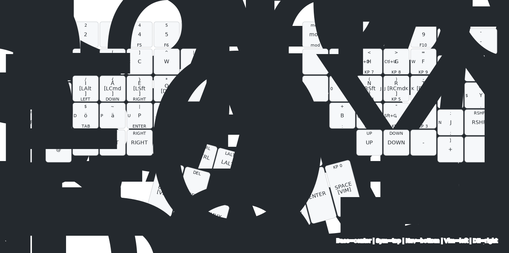
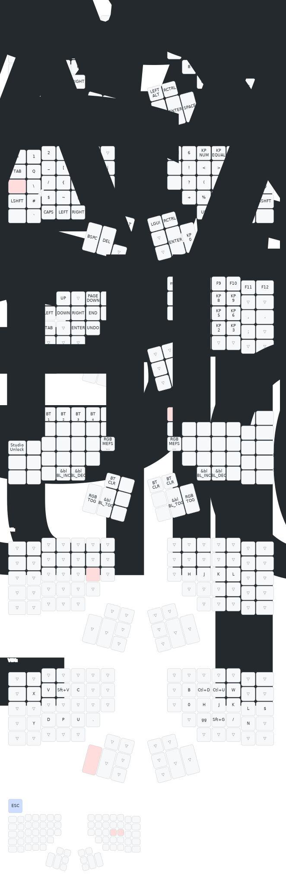
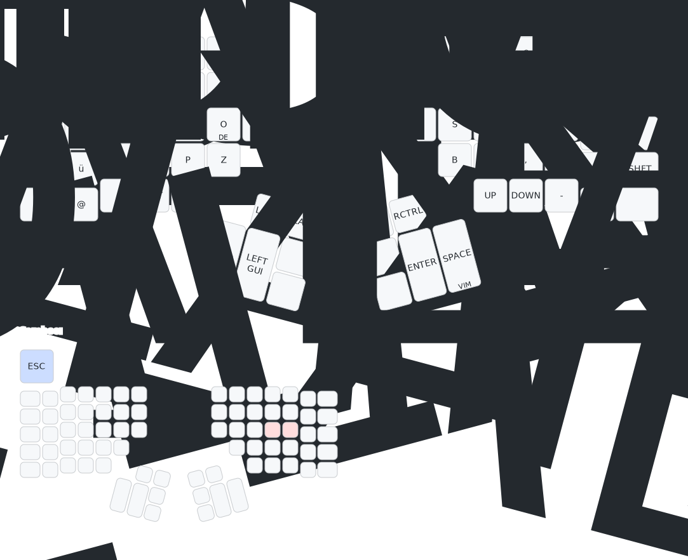
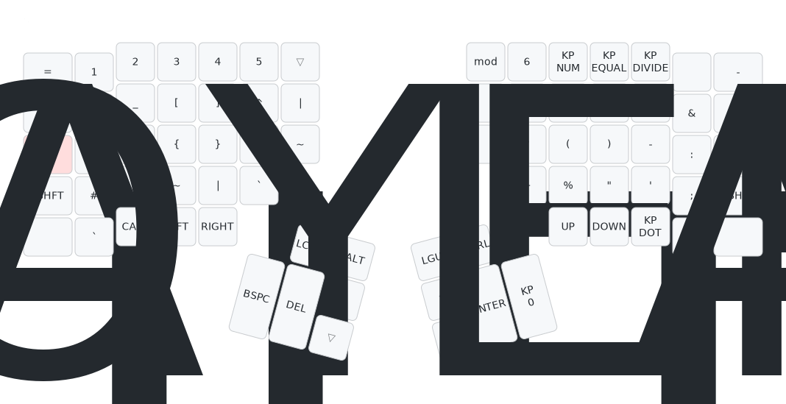
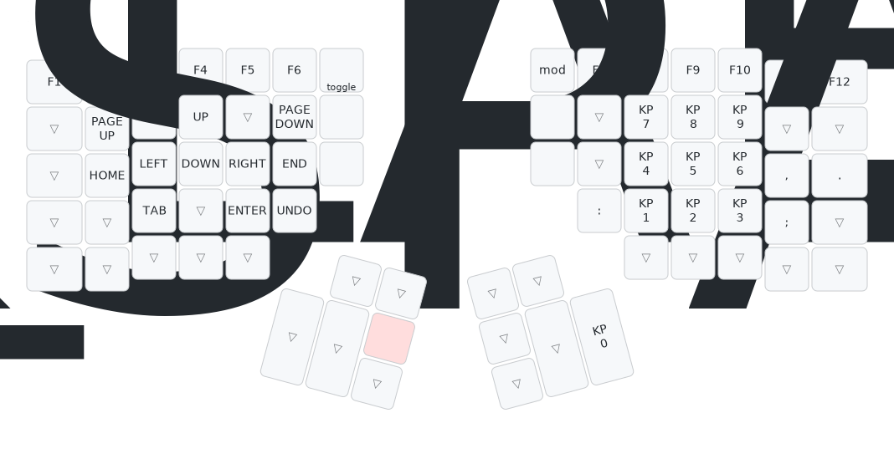
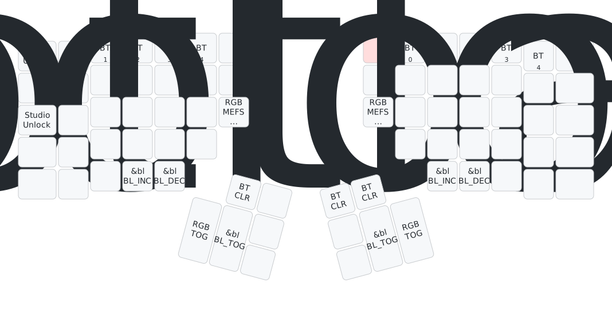
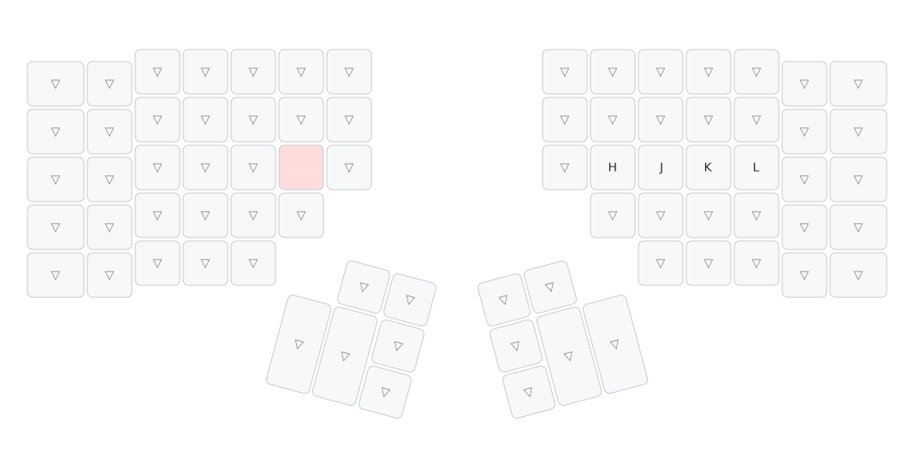
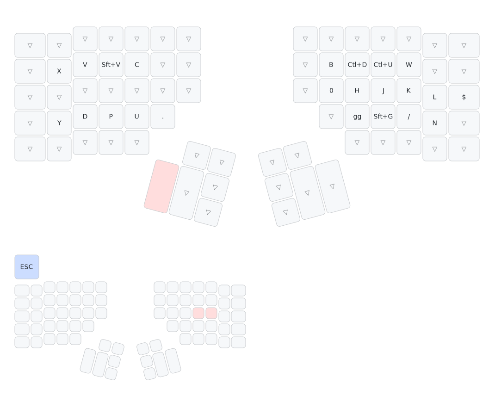

# Keymap Visualization

Auto-generated SVG diagrams of the current keymap. Updated automatically on every push via [keymap-drawer](https://github.com/caksoylar/keymap-drawer).

## Cheat Sheet (All Layers)

One keyboard showing all layers at once: **center** = Base, **top** = Symbols, **bottom** = Nav/Numpad, **left** = Vim, **right** = DE.

## All Layers

## Individual Layers

### Base (Neo2)

### Symbols (Neo Layer 3)

### Navigation / Numpad (Neo Layer 4)

### Mod (Bluetooth / RGB)

### DE (German)

### Vim

